<!-- ============ HEADER ============ -->
<p align="center">
  
</p>

<p align="center">
  <a href="https://wittawat-eight.vercel.app/">
    
  </a>
</p>

<p align="center">
  <a href="https://wittawat-eight.vercel.app/"></a>
  <a href="mailto:Dnaigook@gmail.com"></a>
  <a href="https://github.com/Sungear01"></a>
  
</p>

---

##  About me

```js
const wittawat = {
  role:      "Web developer & UI/UX designer",
  location:  "Bangkok, Thailand 🇹🇭",
  building:  "My portfolio → wittawat-eight.vercel.app",
  stack:     ["Laravel", "PHP", "React", "Node.js", "MySQL"],
  design:    ["Figma", "Photoshop"],
  focus:     "Websites that look good and feel easy to use",
  contact:   "Dnaigook@gmail.com",
};
```

- 🌏 Based in **Bangkok, Thailand**
- 🚀 Working on my **[portfolio site](https://wittawat-eight.vercel.app/)**
- 🎨 Turning Figma designs into real, responsive web pages
- 🌱 Learning more about **Docker** and clean backend architecture
- 💬 Ask me about **Laravel, React, or UI design**
- ⚡ Fun fact: I design first, then code — so the details stay sharp

---

## 🛠️ Tech stack

<p align="center">
  <a href="https://skillicons.dev">
    
  </a>
</p>

<p align="center">
  <a href="https://skillicons.dev">
    
  </a>
</p>

<details>
<summary><b>📋 View as list</b></summary>
<br />

| Area | Tools |
| --- | --- |
| **Frontend** |     |
| **Backend** |    |
| **Database** |  |
| **Design** |   |
| **Tools** |    |

</details>

---

## 🎨 How I design

<p align="center">
  
</p>

<p align="center">
  
</p>

---

## 🌱 Currently leveling up

<p align="center">
  
</p>

<details>
<summary><b>📚 Resources I'm learning from</b></summary>
<br />

- 🎓 [Google UX Design Certificate](https://grow.google/uxdesign/) — the full UX process, step by step
- 📐 [Laws of UX](https://lawsofux.com/) — psychology behind good interfaces
- 🧩 [Figma Learn](https://help.figma.com/hc/en-us/categories/360002051613) — Auto layout, components, prototyping
- ♿ [WebAIM](https://webaim.org/) — accessibility basics and contrast checks
- 💡 [Refactoring UI](https://www.refactoringui.com/) — practical visual design tips for developers

</details>

---

## 📌 Projects

<p align="center">
  <a href="https://github.com/Sungear01/Tiktet-UXUI"></a>
  <a href="https://github.com/Sungear01/WILDTRAIL"></a>
  <a href="https://github.com/Sungear01/line_webapp"></a>
  <a href="https://github.com/Sungear01/-Status-working-Installation-Tracker"></a>
</p>

---

## 📊 GitHub stats

<p align="center">
  
  
</p>

<p align="center">
  
</p>

<p align="center">
  
</p>

<!-- Appears after the "Generate contribution snake" workflow runs once (Actions tab → Run workflow) -->
<p align="center">
  <picture>
    <source media="(prefers-color-scheme: dark)" srcset="https://raw.githubusercontent.com/Sungear01/Sungear01/output/github-contribution-grid-snake-dark.svg" />
    <source media="(prefers-color-scheme: light)" srcset="https://raw.githubusercontent.com/Sungear01/Sungear01/output/github-contribution-grid-snake.svg" />
    
  </picture>
</p>

---

<p align="center">
  <a href="https://wittawat-eight.vercel.app/"></a>
</p>

<p align="center">
  <a href="https://wittawat-eight.vercel.app/"></a>
  <a href="mailto:Dnaigook@gmail.com"></a>
  <a href="https://github.com/Sungear01"></a>
</p>

<p align="center">
  
</p>

<!-- ============ FOOTER ============ -->
<p align="center">
  
</p>
